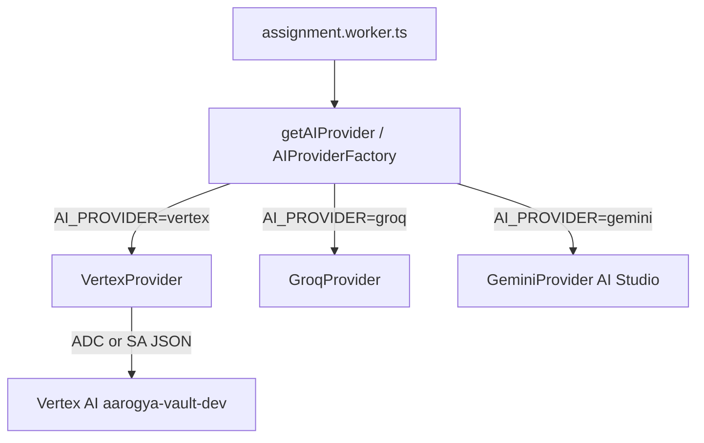

# ExamForge Vertex AI Migration — Implementation Report

**Date:** June 12, 2026  
**Repository:** `/Users/goconqueror/Desktop/vedaAI_prototype`  
**GCP project:** `aarogya-vault-dev`  
**Status:** Phases 3.5 + 4–6 complete — **no deploy, no production cutover**

---

## Executive summary

| Phase | Status |
|-------|--------|
| 3.5 Vertex Validation | ✅ Passed |
| Service account `examforge-vertex@...` | ✅ Created + `roles/aiplatform.user` |
| 4 AI abstraction layer | ✅ Implemented |
| 5 VertexProvider | ✅ Implemented |
| 6 Local verification script | ✅ `npm run test:vertex` passes |
| 7 AI_PROVIDER wiring | ✅ Factory supports `vertex` |
| Deploy / cutover | ⏸ Not performed (per approval) |

**Tests:** 69/69 passing, `tsc --noEmit` clean

---

## Phase 3.5 — Vertex Validation

### Service account

```
examforge-vertex@aarogya-vault-dev.iam.gserviceaccount.com
```

| Action | Result |
|--------|--------|
| Created | ✅ `gcloud iam service-accounts create examforge-vertex` |
| IAM | ✅ `roles/aiplatform.user` only |
| Default compute SA | ❌ Not used |

### Script

| File | Command |
|------|---------|
| `backend/scripts/test-vertex.ts` | `npm run test:vertex` |

### Validation results (ADC, local)

| Metric | Ping | Sample exam |
|--------|------|-------------|
| Latency | ~1–3s (after fix) | ~2–3s |
| Model | `gemini-2.5-flash` | same |
| Region | `asia-south1` | same |
| promptTokenCount | logged | 238 |
| candidatesTokenCount | logged | 76 |
| totalTokenCount | logged | 592 |
| thoughtsTokenCount | logged | 278 |
| Cost in response | N/A — estimate via GCP Billing | |

Sample exam output validated: 1 section, 1 answer key entry, valid JSON.

---

## Phase 4 — AI abstraction layer

### New files

| File | Purpose |
|------|---------|
| `src/services/ai/interfaces/AIProvider.ts` | Extended provider contract |
| `src/services/ai/factory/AIProviderFactory.ts` | `createAIProvider()` |
| `src/services/ai/vertex-exam-schema.ts` | Vertex `responseSchema` for exams |

### Interface methods

- `generateText()`
- `generateJson()`
- `healthCheck()`
- `generateAssignment()` (backward compatible)

### Updated providers

| Provider | File | AI Studio / Groq preserved |
|----------|------|----------------------------|
| Groq | `providers/groq-provider.ts` | ✅ |
| Gemini | `providers/gemini-provider.ts` | ✅ |
| Vertex | `providers/VertexProvider.ts` | ✅ New |

### Factory wiring

`src/services/ai/providers/index.ts` → `createAIProvider(env.aiProvider)`

---

## Phase 5 — VertexProvider

| Setting | Source |
|---------|--------|
| SDK | `@google-cloud/vertexai` |
| Project | `GCP_PROJECT_ID` env |
| Region | `VERTEX_LOCATION` (default `asia-south1`) |
| Model | `VERTEX_MODEL` (default `gemini-2.5-flash`) |
| Auth | ADC locally; SA JSON on Render (future) |
| Structured output | `responseSchema` + `responseMimeType: application/json` |
| Retry | Reuses `retryAIRequest()` |
| Timeout | Reuses `withRequestTimeout()` |

Pattern copied from Aarogya Vault `medical_analysis_provider.ts`.

---

## Phase 6 — Environment updates

### `src/config/env.ts`

```typescript
export const AI_PROVIDERS = ["gemini", "groq", "vertex"] as const;
```

New env fields:

- `gcpProjectId` ← `GCP_PROJECT_ID`
- `vertexLocation` ← `VERTEX_LOCATION`
- `vertexModel` ← `VERTEX_MODEL`
- `vertexMaxOutputTokens` ← `VERTEX_MAX_OUTPUT_TOKENS`

Validation: `GCP_PROJECT_ID` required when `AI_PROVIDER=vertex`.

### `backend/.env.example`

Documented Vertex, Groq, and Gemini AI Studio variables.

### Default unchanged

`AI_PROVIDER` default remains **`groq`** — no production cutover.

---

## Phase 7 — Wiring (no cutover)

To enable Vertex locally or on worker canary:

```bash
AI_PROVIDER=vertex
GCP_PROJECT_ID=aarogya-vault-dev
VERTEX_LOCATION=asia-south1
VERTEX_MODEL=gemini-2.5-flash
```

Worker (`assignment.worker.ts`) unchanged — calls `getAIProvider()` → factory.

---

## Files created

```
backend/scripts/test-vertex.ts
backend/src/services/ai/interfaces/AIProvider.ts
backend/src/services/ai/factory/AIProviderFactory.ts
backend/src/services/ai/providers/VertexProvider.ts
backend/src/services/ai/vertex-exam-schema.ts
docs/vertex-migration/IMPLEMENTATION_REPORT.md
```

## Files modified

```
backend/package.json
backend/package-lock.json
backend/.env.example
backend/src/config/env.ts
backend/src/services/ai/providers/ai-provider.ts
backend/src/services/ai/providers/groq-provider.ts
backend/src/services/ai/providers/gemini-provider.ts
backend/src/services/ai/providers/index.ts
```

## Files not modified (intentionally)

- `assignment.worker.ts` — factory swap sufficient
- `ai.service.ts` — provider-agnostic
- Render configuration — no deploy

---

## Architecture (post-implementation)



---

## Next steps (requires separate approval)

1. **Render worker canary:** mount `examforge-vertex` SA JSON secret; set `AI_PROVIDER=vertex` on worker only
2. **Generate 5–10 real exams**; compare quality vs Groq
3. **Optional:** add Vertex `healthCheck()` to `/health` endpoint
4. **Phase 2 hardening:** Workload Identity Federation (replace JSON key)

---

## SDK deprecation note

`@google-cloud/vertexai` logs a deprecation warning (removal June 2026). Plan migration to `@google/genai` before that date. Aarogya Vault has scaffold adapter at `genai/vertex_gemini_client.ts` for future use.

---

*Implementation complete. Awaiting deploy/cutover approval.*
